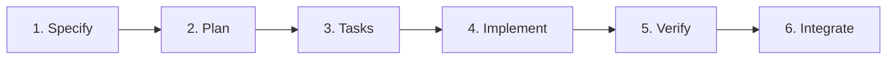

# AE Infinity - Specification & Context Repository

**Project**: Collaborative Shopping List Application  
**Approach**: Spec Kit SDD (Specification-Driven Development)  
**Status**: Active Development  
**Tech Stack**: .NET 9.0 (Backend) + React 19.1 (Frontend) + SQLite (Database)

---

## 🚀 Quick Links

- 📖 **[Getting Started](./GETTING_STARTED.md)** - Set up and start developing
- 📋 **[Feature Catalog](./specs/README.md)** - All features and their specifications
- 🏛️ **[Architecture](./ARCHITECTURE.md)** - System design and technical decisions
- 📜 **[Constitution](./.specify/memory/constitution.md)** - Development principles and standards
- 📝 **[Changelog](./CHANGELOG.md)** - Recent updates and changes
- 🤝 **[Contributing](./CONTRIBUTING.md)** - How to contribute to this project

---

## 📁 Project Structure

```
ae-infinity-context/               # This repository (specifications)
├── .specify/                      # Spec Kit configuration
│   ├── memory/
│   │   └── constitution.md       # Project principles
│   ├── scripts/                  # Automation scripts
│   └── templates/                # Document templates
│
├── specs/                         # Feature specifications (source of truth)
│   ├── 001-user-authentication/
│   │   ├── spec.md              # Business requirements
│   │   ├── plan.md              # Implementation strategy
│   │   ├── data-model.md        # Entity definitions
│   │   ├── quickstart.md        # Developer guide
│   │   ├── tasks.md             # Implementation tasks
│   │   └── contracts/           # API JSON schemas
│   ├── 002-user-profile-management/
│   └── README.md                # Feature catalog
│
├── old_documents/                # Archived documentation (reference only)
├── README.md                     # This file
├── GETTING_STARTED.md           # Onboarding guide
├── ARCHITECTURE.md              # System architecture
├── CHANGELOG.md                 # Project changelog
└── CONTRIBUTING.md              # Contribution guidelines
```

---

## 🔗 Related Repositories

This is the **specifications repository** (documentation only). The actual code lives in:

| Repository | Purpose | Tech Stack |
|------------|---------|------------|
| **ae-infinity-api** | Backend REST API | .NET 9.0, Entity Framework Core, SQLite |
| **ae-infinity-ui** | Frontend SPA | React 19.1, TypeScript, Vite, Tailwind CSS |
| **ae-infinity-context** | Specifications & docs | Markdown, Spec Kit SDD (this repo) |

---

## 🎯 Development Workflow

### **Spec Kit SDD Process**



### **Commands**

```bash
# 1. Create feature specification
/speckit.specify "feature description"

# 2. Generate implementation plan
/speckit.plan XXX-feature-name

# 3. Break down into tasks
/speckit.tasks XXX-feature-name

# 4. Implement in code repositories
# (Follow tasks.md and quickstart.md)

# 5. Verify implementation matches spec
/speckit.analyze XXX-feature-name
```

---

## 📊 Current Status

### **Specifications**

| Status | Count | Progress |
|--------|-------|----------|
| ✅ Specified & Planned | 2 | 15% (2/13 features) |
| 📋 Identified | 11 | 85% remaining |

### **Implementation**

| Feature | Spec | Backend | Frontend | Integration | Status |
|---------|------|---------|----------|-------------|--------|
| **001: User Authentication** | ✅ | 80% | 80% | 0% | Ready for integration |
| **002: User Profile Management** | ✅ | 0% | 0% | 0% | Ready to start |
| **003-013: Other Features** | 📋 | - | - | - | Awaiting specification |

**Next Priority**: Complete integration for Feature 001, then implement Feature 002.

---

## 🏗️ Technology Stack

### **Backend** (`ae-infinity-api`)
- **Framework**: ASP.NET Core 9.0
- **Architecture**: Clean Architecture (API → Application → Domain → Infrastructure)
- **Patterns**: MediatR (CQRS), FluentValidation, Repository Pattern
- **Database**: SQLite with Entity Framework Core 9.0
- **Authentication**: JWT (HMAC-SHA256, 24hr expiration)
- **Real-time**: SignalR for collaborative features
- **Testing**: xUnit, Moq, WebApplicationFactory

### **Frontend** (`ae-infinity-ui`)
- **Framework**: React 19.1 with TypeScript (strict mode)
- **Build Tool**: Vite 7.1
- **Styling**: Tailwind CSS 3.4
- **Routing**: React Router 7.9
- **Forms**: React Hook Form 7.51
- **Testing**: Vitest, React Testing Library, MSW
- **Real-time**: SignalR client

### **Database** (SQLite)
- **Location**: `ae-infinity-api/app.db` (local file)
- **ORM**: Entity Framework Core 9.0
- **Migrations**: Code-first with EF migrations
- **No separate server required** - embedded database

---

## 📚 Documentation Philosophy

### **Specification-Driven Development**

Every feature starts with a **complete specification** before any code is written:

1. **spec.md** - Business requirements (WHAT and WHY)
   - User stories with priorities (P1, P2, P3)
   - Acceptance scenarios (Given-When-Then)
   - Success criteria (measurable outcomes)

2. **plan.md** - Implementation strategy (HOW)
   - Technical context (tech stack, dependencies)
   - Constitution check (quality gates)
   - Implementation phases
   - Testing strategy

3. **data-model.md** - Technical design (DETAILS)
   - Entity definitions
   - DTOs and validation rules
   - Database queries
   - Caching strategies

4. **quickstart.md** - Developer guide (STEP-BY-STEP)
   - Code examples
   - Testing commands
   - Common issues and solutions

5. **tasks.md** - Implementation tasks (CHECKLIST)
   - Organized by user story
   - Parallel execution opportunities
   - Definition of done

### **Benefits**

- ✅ **AI-Friendly**: Specs provide complete context for AI coding assistants
- ✅ **Testable**: Every requirement has acceptance criteria
- ✅ **Traceable**: Link requirements → implementation → tests
- ✅ **Collaborative**: Product, design, and engineering share same source of truth
- ✅ **Maintainable**: New team members understand WHY decisions were made

---

## 🎓 Learning Resources

### **New to the Project?**
1. Start with [GETTING_STARTED.md](./GETTING_STARTED.md) - 5-minute quick start
2. Read [Constitution](./.specify/memory/constitution.md) - Development principles
3. Browse [specs/README.md](./specs/README.md) - Feature catalog
4. Review [Feature 001](./specs/001-user-authentication/spec.md) - Example specification

### **Working on a Feature?**
1. Read `specs/XXX-feature/spec.md` - Understand requirements
2. Review `specs/XXX-feature/plan.md` - Implementation strategy
3. Follow `specs/XXX-feature/quickstart.md` - Step-by-step guide
4. Check off tasks in `specs/XXX-feature/tasks.md` - Track progress

### **Need Architecture Context?**
- [ARCHITECTURE.md](./ARCHITECTURE.md) - Overall system design
- Per-feature `plan.md` - Feature-specific architecture

---

## 🤝 Contributing

We follow **Spec Kit SDD** methodology:

1. **Specification First** - No code without specs
2. **Test-Driven Development** - 80% coverage minimum
3. **Clean Architecture** - Separation of concerns
4. **Real-time Collaboration** - SignalR for live updates
5. **Security by Design** - JWT auth, validation, HTTPS

See [CONTRIBUTING.md](./CONTRIBUTING.md) for detailed guidelines.

---

## 📞 Getting Help

### **Questions About...**

- **Spec Kit Commands**: See `.specify/templates/` for command documentation
- **Feature Specifications**: Check `specs/XXX-feature/README.md`
- **Architecture Decisions**: Review [ARCHITECTURE.md](./ARCHITECTURE.md)
- **Development Standards**: Read [Constitution](./.specify/memory/constitution.md)
- **API Contracts**: Look in `specs/XXX-feature/contracts/`

### **Common Commands**

```bash
# View feature catalog
cat specs/README.md

# Check project structure
tree -L 2 specs/

# View constitution
cat .specify/memory/constitution.md

# Start backend (in ae-infinity-api repo)
dotnet run --project AeInfinity.API

# Start frontend (in ae-infinity-ui repo)
npm run dev

# Run tests
dotnet test           # Backend
npm test             # Frontend
```

---

## 📈 Project Metrics

### **Documentation**

- **Specifications**: 2 complete, 11 planned (13 total features)
- **Total Pages**: ~200 pages of specifications
- **Constitution**: 1 document (200 lines)
- **Test Coverage Target**: 80% minimum

### **Implementation**

- **Backend Endpoints**: 12 implemented, ~30 planned
- **Frontend Components**: 25+ implemented
- **Test Suites**: Unit, Integration, Component tests
- **Database Tables**: 8 entities (User, List, Item, Collaborator, etc.)

---

## 📅 Recent Updates

**2025-11-05** - Spec Kit SDD Adoption
- ✅ Adopted Spec Kit methodology
- ✅ Created constitution.md with project principles
- ✅ Completed Feature 001 specification (authentication)
- ✅ Completed Feature 002 specification (profile management)
- ✅ Generated master feature catalog

**See [CHANGELOG.md](./CHANGELOG.md) for complete history**

---

## 📄 License

[Your License Here]

---

## 🎯 Vision

Build a **specification-driven, AI-assisted, collaborative shopping list application** that demonstrates:

- ✅ How to structure complex features with complete specifications
- ✅ How to enable AI coding assistants with rich context
- ✅ How to maintain quality through constitution-based gates
- ✅ How to build real-time collaborative features
- ✅ How to create maintainable, testable, documented codebases

**Welcome to the team!** 🚀

