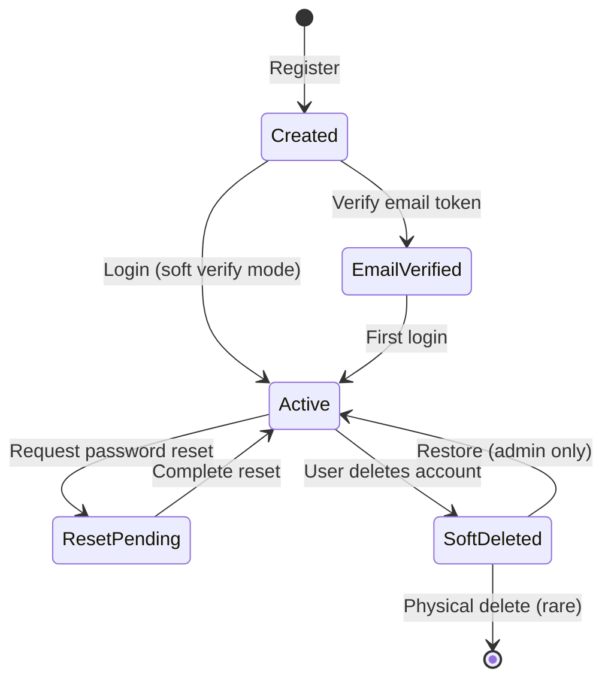

# Data Model: User Authentication

**Feature**: 001-user-authentication  
**Created**: 2025-11-05  
**Last Updated**: 2025-11-05  
**Status**: ✅ Verified Against Actual Implementation

**Verification**: This data model has been verified against the actual codebase at `../ae-infinity-api` (see [ANALYSIS.md](./ANALYSIS.md) for details)

---

## ⚠️ Key Implementation Notes

1. **Password Reset Tokens**: Stored INLINE in User entity (not separate table)
2. **Soft Delete**: All entities use soft delete pattern with `IsDeleted` flag
3. **Inheritance**: User extends BaseAuditableEntity extends BaseEntity
4. **Validation**: Via FluentValidation (not data annotations)
5. **AvatarUrl**: Max 500 chars (not 2048)

---

## Entity Definitions

### User Entity

**Purpose**: Represents a registered user account with authentication credentials and profile information.

**Location**: `AeInfinity.Domain/Entities/User.cs`

**Inheritance**: `User` extends `BaseAuditableEntity` extends `BaseEntity`

#### Fields (Direct)

| Field | Type | Constraints | Description |
|-------|------|-------------|-------------|
| `Email` | string | Required, Max 255 chars, Lowercase | User's email address for login |
| `EmailNormalized` | string | Required, Unique, Max 255 chars, Indexed | Normalized email for case-insensitive lookups |
| `DisplayName` | string | Required, Min 2 chars, Max 100 chars | User's display name shown in UI |
| `PasswordHash` | string | Required, Max 255 chars | BCrypt hashed password (never store plaintext) |
| `AvatarUrl` | string? | Optional, Max 500 chars | URL to user's profile picture |
| `IsEmailVerified` | bool | Required, Default: false | Whether email address has been verified |
| `EmailVerificationToken` | string? | Optional, Max 255 chars | Token for email verification flow |
| `PasswordResetToken` | string? | Optional, Max 255 chars | Token for password reset (stored inline, not separate table) |
| `PasswordResetExpiresAt` | DateTime? | Optional, UTC | Expiration timestamp for password reset token |
| `LastLoginAt` | DateTime? | Optional, UTC | Timestamp of most recent successful login |

#### Fields (Inherited from BaseEntity)

| Field | Type | Constraints | Description |
|-------|------|-------------|-------------|
| `Id` | Guid | PK, Required, Unique | Unique user identifier (from BaseEntity) |
| `CreatedAt` | DateTime | Required, UTC | Record creation timestamp (from BaseEntity) |
| `UpdatedAt` | DateTime? | Optional, UTC | Last modification timestamp (from BaseEntity) |
| `DeletedAt` | DateTime? | Optional, UTC | Soft delete timestamp (from BaseEntity) |
| `IsDeleted` | bool | Required, Default: false | Soft delete flag (from BaseEntity) |

#### Fields (Inherited from BaseAuditableEntity)

| Field | Type | Constraints | Description |
|-------|------|-------------|-------------|
| `CreatedBy` | Guid? | Optional, FK → User | User who created this record (from BaseAuditableEntity) |
| `UpdatedBy` | Guid? | Optional, FK → User | User who last modified this record (from BaseAuditableEntity) |
| `DeletedBy` | Guid? | Optional, FK → User | User who soft-deleted this record (from BaseAuditableEntity) |

#### Indexes

```sql
-- Primary key
PRIMARY KEY (Id)

-- Unique constraint on normalized email (case-insensitive, excludes soft-deleted)
UNIQUE INDEX IX_Users_EmailNormalized ON Users(EmailNormalized) WHERE IsDeleted = false

-- Soft delete index (for query filter performance)
INDEX IX_Users_IsDeleted ON Users(IsDeleted)

-- Token lookup indexes
INDEX IX_Users_EmailVerificationToken ON Users(EmailVerificationToken)
INDEX IX_Users_PasswordResetToken ON Users(PasswordResetToken)
```

**Note**: EF Core adds query filter `WHERE IsDeleted = false` automatically to all queries unless explicitly disabled.

#### Validation Rules

**Email**:
- Must be valid email format (RFC 5322)
- Maximum 255 characters
- Unique across all users (case-insensitive)
- Automatically normalized to uppercase for storage in `EmailNormalized`

**DisplayName**:
- Minimum 2 characters
- Maximum 100 characters
- Cannot be null or empty
- Trimmed of leading/trailing whitespace

**Password** (before hashing):
- Minimum 8 characters
- Must contain at least one uppercase letter
- Must contain at least one lowercase letter
- Must contain at least one number
- Must contain at least one special character (!@#$%^&*(),.?":{}|<>)
- Hashed with BCrypt (cost factor 12) before storage

**AvatarUrl**:
- Must be valid URL format if provided
- Recommended: HTTPS URLs only
- Stored as-is (no validation of image existence)

#### Relationships

```text
User (1) ─────< ShoppingList (Many)
  │
  │ Owner relationship
  └─> Lists owned by this user

User (1) ─────< ListCollaborator (Many)
  │
  │ Collaboration relationship  
  └─> Lists this user collaborates on

User (1) ─────< ShoppingItem (Many)
  │
  │ Creator relationship
  └─> Items created by this user

User (1) ─────< PasswordResetToken (Many)
  │
  │ Password reset relationship
  └─> Active/expired reset tokens
```

#### State Transitions



**States** (implicit, not stored as enum):
- **Created**: Account exists, email not verified (`IsEmailVerified = false`), never logged in
- **EmailVerified**: Email confirmed but not yet logged in (`IsEmailVerified = true`, `LastLoginAt = null`)
- **Active**: Regular user state (`IsEmailVerified = true`, `LastLoginAt != null`)
- **ResetPending**: Password reset requested (`PasswordResetToken != null`, `PasswordResetExpiresAt > now`)
- **SoftDeleted**: Account marked as deleted (`IsDeleted = true`, `DeletedAt != null`)

**Soft Delete Pattern**:
- Users are NEVER physically deleted from database
- Setting `IsDeleted = true` excludes them from all queries (via EF Core query filter)
- Unique constraints (email) respect soft delete via filtered index
- Can be restored by setting `IsDeleted = false`

---

### BaseEntity (Abstract)

**Purpose**: Base class providing common fields for all entities

**Location**: `AeInfinity.Domain/Common/BaseEntity.cs`

#### Fields

| Field | Type | Constraints | Description |
|-------|------|-------------|-------------|
| `Id` | Guid | PK, Required | Unique identifier for every entity |
| `CreatedAt` | DateTime | Required, UTC | When record was created |
| `UpdatedAt` | DateTime? | Optional, UTC | When record was last updated |
| `DeletedAt` | DateTime? | Optional, UTC | When record was soft-deleted |
| `IsDeleted` | bool | Required, Default: false | Soft delete flag |

---

### BaseAuditableEntity (Abstract)

**Purpose**: Extends BaseEntity with audit trail fields

**Location**: `AeInfinity.Domain/Common/BaseAuditableEntity.cs`

**Inheritance**: Extends `BaseEntity`

#### Additional Fields

| Field | Type | Constraints | Description |
|-------|------|-------------|-------------|
| `CreatedBy` | Guid? | Optional, FK → User | Which user created this record |
| `UpdatedBy` | Guid? | Optional, FK → User | Which user last modified this record |
| `DeletedBy` | Guid? | Optional, FK → User | Which user soft-deleted this record |

---

### Password Reset (Inline Fields, Not Separate Entity)

**Purpose**: Password reset tokens are stored INLINE in the User entity, not in a separate table.

**Location**: User entity fields (see above)

#### Inline Fields

| Field | Type | Location | Description |
|-------|------|----------|-------------|
| `PasswordResetToken` | string? | User entity | Cryptographically secure random token (max 255 chars) |
| `PasswordResetExpiresAt` | DateTime? | User entity | Token expiration timestamp (typically 1 hour from creation) |

**Design Pattern**: Simple inline storage
- Only ONE active reset token per user at a time
- New reset request overwrites previous token
- No separate table or entity needed
- Simpler than maintaining token history

#### Validation Rules

**Token**:
- Cryptographically secure random string
- Stored in `PasswordResetToken` field (max 255 chars)
- URL-safe format recommended
- Expires after 1 hour (configurable)

**Business Rules**:
- User can request new reset at any time (overwrites previous token)
- Token must not be expired (`PasswordResetExpiresAt > DateTime.UtcNow`)
- Token is cleared after successful password reset
- Maximum 3 reset requests per hour per email (rate limiting planned)
- Token is also cleared if password is changed through other means

#### Example Token Generation

```csharp
// Generate secure random token
using var rng = RandomNumberGenerator.Create();
var bytes = new byte[32]; // 32 bytes = sufficient entropy
rng.GetBytes(bytes);
var token = Convert.ToBase64String(bytes)
    .Replace("+", "-")
    .Replace("/", "_")
    .Replace("=", ""); // URL-safe base64

// Store in user entity
user.PasswordResetToken = token;
user.PasswordResetExpiresAt = DateTime.UtcNow.AddHours(1);
await dbContext.SaveChangesAsync();
```

#### Usage Flow

1. **Request Reset**: Generate token, store in `PasswordResetToken` field, send email
2. **Validate Token**: Check token matches AND `PasswordResetExpiresAt > now`
3. **Reset Password**: Hash new password, clear token fields, save
4. **Token Cleanup**: Expired tokens remain until next reset request (no cleanup job needed)

---

## DTOs (Data Transfer Objects)

### LoginRequest

**Purpose**: Credentials for authentication

**Location**: `AeInfinity.Application/Common/Models/DTOs/LoginRequest.cs`

```csharp
public class LoginRequest
{
    public string Email { get; set; } = string.Empty;
    public string Password { get; set; } = string.Empty;
}
```

**Validation**: Via FluentValidation (not data annotations)
- `LoginRequestValidator` enforces email format and required fields
- Validation occurs in MediatR pipeline before handler execution

**JSON Schema**: See [contracts/login-request.json](./contracts/login-request.json)

---

### LoginResponse

**Purpose**: Authentication success response with JWT token and user data

**Location**: `AeInfinity.Application/Common/Models/DTOs/LoginResponse.cs`

```csharp
public class LoginResponse
{
    public string Token { get; set; } = string.Empty;
    public DateTime ExpiresAt { get; set; }
    public UserDto User { get; set; } = null!;
}
```

**Validation**: Ensured by business logic (tokens always generated)

**JSON Schema**: See [contracts/login-response.json](./contracts/login-response.json)

---

### UserDto

**Purpose**: Complete user profile information (excludes password hash for security)

**Location**: `AeInfinity.Application/Common/Models/DTOs/UserDto.cs`

```csharp
public class UserDto
{
    public Guid Id { get; set; }
    public string Email { get; set; } = string.Empty;
    public string DisplayName { get; set; } = string.Empty;
    public string? AvatarUrl { get; set; }
    public bool IsEmailVerified { get; set; }
    public DateTime? LastLoginAt { get; set; }
    public DateTime CreatedAt { get; set; }
}
```

**Mapping**: `User` entity → `UserDto` (AutoMapper profile)

**Security Note**: Password hash, reset tokens, and verification tokens are NEVER included in DTOs

**JSON Schema**: See [contracts/user.json](./contracts/user.json)

---

### UserBasicDto

**Purpose**: Minimal user information for nested references (e.g., list collaborators, item creators)

**Location**: `AeInfinity.Application/Common/Models/DTOs/UserDto.cs` (same file as UserDto)

```csharp
public class UserBasicDto
{
    public Guid Id { get; set; }
    public string DisplayName { get; set; } = string.Empty;
    public string? AvatarUrl { get; set; }
}
```

**Mapping**: `User` entity → `UserBasicDto` (AutoMapper profile)

**Usage**: Embedded in list collaborators, item metadata, etc.

**JSON Schema**: See [contracts/user-basic.json](./contracts/user-basic.json)

---

## JWT Token Claims

**Purpose**: Stateless authentication token (not stored in database)

**Algorithm**: HMAC-SHA256 (HS256)  
**Expiration**: 24 hours from issuance  
**Storage**: Client-side only (localStorage or httpOnly cookie)

### Standard Claims

| Claim | Type | Description | Example |
|-------|------|-------------|---------|
| `sub` | string | Subject (User ID) | "3fa85f64-5717-4562-b3fc-2c963f66afa6" |
| `jti` | string | JWT ID (unique token identifier) | "abc123..." |
| `iat` | number | Issued At (Unix timestamp) | 1730803200 |
| `exp` | number | Expiration (Unix timestamp) | 1730889600 |
| `iss` | string | Issuer | "AeInfinityApi" |
| `aud` | string | Audience | "AeInfinityClient" |

### Custom Claims

| Claim | Type | Description | Example |
|-------|------|-------------|---------|
| `email` | string | User's email address | "sarah@example.com" |
| `name` | string | User's display name | "Sarah Johnson" |

### Token Validation

```csharp
var tokenValidationParameters = new TokenValidationParameters
{
    ValidateIssuer = true,
    ValidIssuer = "AeInfinityApi",
    
    ValidateAudience = true,
    ValidAudience = "AeInfinityClient",
    
    ValidateLifetime = true,
    ClockSkew = TimeSpan.Zero, // No grace period
    
    ValidateIssuerSigningKey = true,
    IssuerSigningKey = new SymmetricSecurityKey(
        Encoding.UTF8.GetBytes(configuration["Jwt:Secret"])
    )
};
```

---

## Database Schema (SQL)

### Users Table

```sql
CREATE TABLE Users (
    -- Primary key
    Id UNIQUEIDENTIFIER PRIMARY KEY DEFAULT NEWID(),
    
    -- Authentication fields
    Email NVARCHAR(255) NOT NULL,
    EmailNormalized NVARCHAR(255) NOT NULL,
    PasswordHash NVARCHAR(255) NOT NULL,
    
    -- Profile fields
    DisplayName NVARCHAR(100) NOT NULL,
    AvatarUrl NVARCHAR(500) NULL,
    
    -- Email verification
    IsEmailVerified BIT NOT NULL DEFAULT 0,
    EmailVerificationToken NVARCHAR(255) NULL,
    
    -- Password reset (inline, not separate table)
    PasswordResetToken NVARCHAR(255) NULL,
    PasswordResetExpiresAt DATETIME2 NULL,
    
    -- Activity tracking
    LastLoginAt DATETIME2 NULL,
    
    -- Audit fields (from BaseAuditableEntity)
    CreatedBy UNIQUEIDENTIFIER NULL,
    UpdatedBy UNIQUEIDENTIFIER NULL,
    DeletedBy UNIQUEIDENTIFIER NULL,
    
    -- Base entity fields
    CreatedAt DATETIME2 NOT NULL DEFAULT GETUTCDATE(),
    UpdatedAt DATETIME2 NULL,
    DeletedAt DATETIME2 NULL,
    IsDeleted BIT NOT NULL DEFAULT 0,
    
    -- Constraints
    CONSTRAINT CK_Users_DisplayName_MinLength CHECK (LEN(DisplayName) >= 2),
    CONSTRAINT CK_Users_Email_Format CHECK (Email LIKE '%_@_%.__%')
);

-- Indexes
CREATE UNIQUE INDEX IX_Users_EmailNormalized 
    ON Users(EmailNormalized) WHERE IsDeleted = 0;

CREATE INDEX IX_Users_IsDeleted 
    ON Users(IsDeleted);

CREATE INDEX IX_Users_EmailVerificationToken 
    ON Users(EmailVerificationToken);

CREATE INDEX IX_Users_PasswordResetToken 
    ON Users(PasswordResetToken);
```

**Note**: No separate PasswordResetTokens table. Password reset tokens are stored inline in the Users table.

---

## Entity Framework Core Configuration

### User Configuration

**Location**: `AeInfinity.Infrastructure/Data/Configurations/UserConfiguration.cs`

```csharp
public class UserConfiguration : IEntityTypeConfiguration<User>
{
    public void Configure(EntityTypeBuilder<User> builder)
    {
        builder.ToTable("Users");
        
        builder.HasKey(u => u.Id);
        
        builder.Property(u => u.Email)
            .IsRequired()
            .HasMaxLength(255);
        
        builder.Property(u => u.EmailNormalized)
            .IsRequired()
            .HasMaxLength(255);
        
        builder.HasIndex(u => u.EmailNormalized)
            .IsUnique();
        
        builder.Property(u => u.DisplayName)
            .IsRequired()
            .HasMaxLength(100);
        
        builder.Property(u => u.PasswordHash)
            .IsRequired()
            .HasMaxLength(255);
        
        builder.Property(u => u.AvatarUrl)
            .HasMaxLength(2048);
        
        builder.Property(u => u.IsEmailVerified)
            .IsRequired()
            .HasDefaultValue(false);
        
        builder.Property(u => u.CreatedAt)
            .IsRequired();
        
        // Relationships configured in respective entity configurations
    }
}
```

---

## Data Access Patterns

### Repository Interface

**Location**: `AeInfinity.Core/Interfaces/IUserRepository.cs`

```csharp
public interface IUserRepository
{
    Task<User?> GetByIdAsync(Guid id, CancellationToken cancellationToken = default);
    Task<User?> GetByEmailAsync(string email, CancellationToken cancellationToken = default);
    Task<User?> GetByNormalizedEmailAsync(string normalizedEmail, CancellationToken cancellationToken = default);
    Task<bool> EmailExistsAsync(string email, CancellationToken cancellationToken = default);
    Task<User> CreateAsync(User user, CancellationToken cancellationToken = default);
    Task UpdateAsync(User user, CancellationToken cancellationToken = default);
    Task DeleteAsync(Guid id, CancellationToken cancellationToken = default);
}
```

### CQRS Pattern

Authentication operations use **Command Query Responsibility Segregation** (CQRS) via MediatR:

**Commands** (write operations):
- `LoginCommand` → `LoginHandler` → Returns `LoginResponse`
- `RegisterCommand` → `RegisterHandler` → Returns `LoginResponse`
- `LogoutCommand` → `LogoutHandler` → Returns void
- `ForgotPasswordCommand` → `ForgotPasswordHandler` → Returns void
- `ResetPasswordCommand` → `ResetPasswordHandler` → Returns void

**Queries** (read operations):
- `GetCurrentUserQuery` → `GetCurrentUserHandler` → Returns `UserDto`

---

## Security Considerations

### Password Storage

- ✅ **Never store plaintext passwords**
- ✅ Use BCrypt with cost factor 12 (configurable)
- ✅ Automatic salt generation per password
- ✅ Password hashing happens in application layer (before database)

### Email Privacy

- ✅ Case-insensitive email lookup via `EmailNormalized` field
- ✅ Original email case preserved in `Email` field for display
- ✅ Generic error messages prevent email enumeration

### Token Security

- ✅ JWT signed with HMAC-SHA256
- ✅ 24-hour expiration enforced
- ✅ No server-side token storage (stateless)
- ⚠️ Tokens valid until expiration (no blacklist in v1)

### Rate Limiting (Planned)

- Login: 5 attempts per minute per IP
- Registration: 3 per hour per IP
- Password reset: 3 per hour per email

---

## Migration History

### Initial Migration (Already Applied)

```bash
dotnet ef migrations add InitialCreate
dotnet ef database update
```

Creates:
- Users table with all fields
- Indexes on email and emailNormalized
- Default constraints

### Future Migration (Planned)

```bash
dotnet ef migrations add AddPasswordResetTokens
dotnet ef database update
```

Will create:
- PasswordResetTokens table
- Foreign key to Users
- Indexes on token and expiration

---

## Related Documentation

- **API Contracts**: [contracts/](./contracts/) - JSON schemas
- **Business Spec**: [spec.md](./spec.md) - User requirements
- **Implementation Plan**: [plan.md](./plan.md) - Technical approach
- **Quick Start**: [quickstart.md](./quickstart.md) - Developer guide

